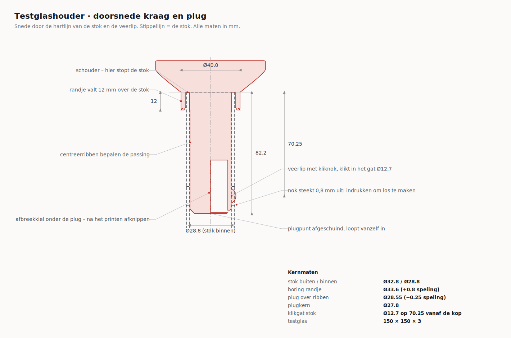

# Testglashouder voor fire-beam testglas op een Solo teststok

Houder voor een rood testglas van 150 × 150 × 3 mm, met een steel die op de
teststok past: een kort randje valt **over** de stok, de lange plug gaat **in**
de stok en een geprinte veerlip klikt in het gat Ø12,7 van de stok.



## Wat zit er in

| Bestand | Wat het is |
|---|---|
| `stl/pasmal-stok.stl` | **Print dit eerst.** Alleen de kraag + plug, om de passing en de klikpositie te testen. |
| `stl/testglashouder.stl` | De houder zelf, één stuk. |
| `stl/glasklem.stl` | Latje dat na het glas in de sleuf schuift en het glas op zijn plek houdt. |
| `testglashouder.py` | Het model. Alle maten staan bovenin en zijn aanpasbaar. |
| `maatschets.py`, `render.py` | Maken de tekening en de plaatjes opnieuw. |

Opnieuw genereren na een wijziging:

```bash
python3 testglashouder.py && python3 maatschets.py && python3 render.py
```

## Maten waar het ontwerp op gebouwd is

Dit zijn jouw metingen. Ze staan bovenin `testglashouder.py`.

| | |
|---|---|
| Stok buiten / binnen | Ø32,8 / Ø28,8 mm |
| Klikgat in de stok | Ø12,7 mm |
| Kop van de stok → gat | 63,9 mm |
| Testglas | 150 × 150 × 3 mm |

**Let op deze aanname.** Ik heb de 63,9 mm gelezen als de afstand tot de
*dichtstbijzijnde rand* van het gat, want zo staat de schuifmaat op je foto.
Het hart van het gat komt dan op 63,9 + 12,7/2 = **70,25 mm**, en daar zit de
kliknok. Was de 63,9 mm tot het *hart* van het gat gemeten, zet dan bovenin het
script `HOLE_MEASURED_TO = "center"` en genereer opnieuw. De pasmal is er juist
om dit in een half uurtje uit te sluiten.

## Printen

De houder is zo ontworpen dat hij **plat op zijn rug** print, met de vlakke
achterkant van de lijst op het bed. In die stand loopt de belasting van de
steel evenwijdig aan de lagen, wat veruit het sterkst is, en zijn er geen
overhangen boven de 45°.

Om support helemaal te vermijden zit er één ontwerptruc in: onder de plug loopt
een dunne **afbreekkiel** van 1 mm dik. Zonder die kiel zou de plug 5 mm boven
het bed zweven, omdat de kraag dikker is dan de plug. De kiel zit op de
onderkant van de plug, precies daar waar géén centreerrib loopt — je knipt hem
er na het printen af en de passing in de buis blijft ongemoeid.

### Instellingen (Bambu Studio, H2S, 0.4 nozzle)

| Instelling | Waarde | Waarom |
|---|---|---|
| Materiaal | **PETG HF** | Taaier dan PLA en blijft veren. PLA scheurt op den duur bij de veerlip, en zakt door in een warme bus. ASA als hij echt buiten leeft. |
| Laaghoogte | 0,20 mm | 0,16 mm als je de kliknok mooier wilt. |
| Wanden | **4** | De veerlip is 2,2 mm dik; met 4 wanden is hij massief en veert netjes. |
| Boven / onder | 4 / 4 | |
| Infill | 15–20 % gyroid | De plug en de hals zijn dikke stukken; meer heeft geen zin. |
| **Support** | **uit** | Niet nodig dankzij de kiel. |
| Brim | uit | Het contactvlak is al ruim 40 cm². |
| Elephant foot | 0,15 mm (standaard) | Belangrijk: de achterkant en het kraagvlakje liggen allebei op het bed. |
| Naad | Aligned / achter | Zo komt de naad niet op een centreerrib. |

Leg de houder **diagonaal of over de lengte van het bed**: hij is 310 × 171 mm,
dus op de 350 × 320 mm van de H2S past hij ruim. Reken op ruwweg 90–120 g PETG
en 7–10 uur; Bambu Studio geeft je het echte getal.

De pasmal en de glasklem print je gewoon apart. De pasmal zet je rechtop, op het
platte vlak van de kraag, met de plug omhoog — dan is er ook daar geen support
nodig. De glasklem legt plat.

### Na het printen

1. Knip de kiel onder de plug eraf met een zijkniptang en schaaf de restjes weg
   met een mesje. Er mag niets meer uitsteken.
2. Loop met een mesje één keer langs de zaagsnede rond de veerlip, zodat hij
   echt vrij beweegt. Druk hem een paar keer in — hij moet soepel terugveren.
3. Ontbraam de mond van het randje en de punt van de plug.

## Volgorde van in elkaar zetten

1. Schuif het testglas van bovenaf tussen de twee oren in de sleuf, tot het op
   de onderbalk rust.
2. Schuif de glasklem er daarachteraan in, tot de nokjes in de kuiltjes klikken.
   Aan het duimgreepje trek je hem er weer uit als het glas vervangen moet.
3. Duw de plug in de stok tot de kop van de stok tegen de schouder komt. De
   kliknok klikt hoorbaar in het gat en steekt er 0,8 mm buiten uit.
4. Losmaken: nok indrukken met een duim of een pen en de houder eraf trekken.

## Als de passing niet klopt

Alles staat bovenin `testglashouder.py`; wijzig het getal en draai het script
opnieuw.

| Wat je merkt | Wat je aanpast |
|---|---|
| Plug gaat te stroef in de buis | `FIT_RIB` groter (bijv. 0,4) |
| Plug wiebelt in de buis | `FIT_RIB` kleiner (bijv. 0,15) |
| Randje klemt op de stok | `FIT_SKIRT` groter |
| Kliknok valt naast het gat | `HOLE_MEASURED_TO` omzetten, of `HOLE_FROM_TIP` corrigeren |
| Kliknok veert te zwaar | `TAB_T` kleiner (bijv. 1,9) of `TAB_LEN` groter |
| Glas zit te klem of rammelt | `GLASS_FIT_XY` en `GLASS_FIT_T` |
| Ander glasformaat | `GLASS_W`, `GLASS_H`, `GLASS_T` |

## Eigen opdruk

Op de onderbalk zit een verzonken vlakje van 100 × 16 mm, 0,6 mm diep. Daar kun
je in Bambu Studio met de tekst- of SVG-tool je eigen naam of logo in zetten. Ik
heb er bewust niets van een ander merk op gezet.
