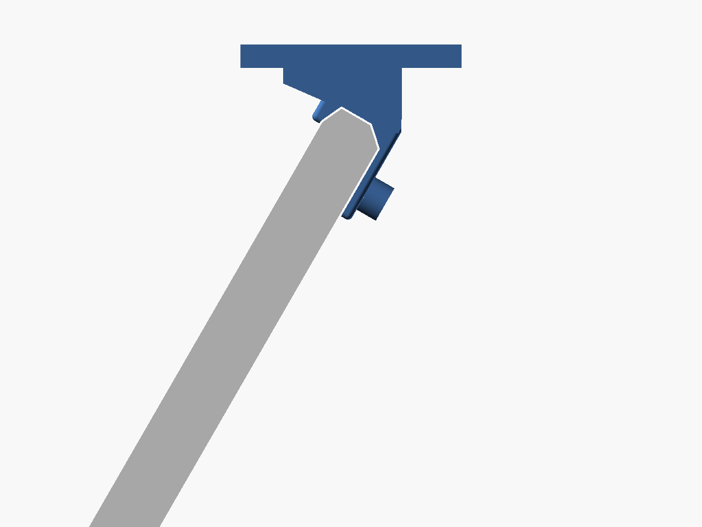

# Speakerplateau voor de Waves LV1 Classic

Een plateau voor een lichte monitorspeaker (< 1 kg), geklemd over de bovenrand
van de schermklep. Geen enkele aanpassing aan de console: puur vormsluiting
plus een klemschroef met een zachte drukplaat.



## Onderdelen

| Bestand | Aantal | Materiaal |
| ------- | ------ | --------- |
| `LV1_saddle.stl` | 2 | PETG of ASA |
| `LV1_platform.stl` | 1 | PETG of ASA |
| `LV1_pad.stl` | 2 | TPU 95A |

Bijkomend:

- 4 × M4 smeltinzetstuk (heat-set, Ø5.7 × 8 mm) + 4 × M4×20 verzonken bout
- 2 × M5 smeltinzetstuk (Ø6.4 × 9.5 mm) + 2 × M5×30 duimschroef of inbus
- zelfklevend vilt van 1 mm voor de binnenkant van de kep (voorlip, topvlak,
  achterpoot)

Geen inzetstukken in huis? Zet in de `.scad` `m4_ins_d = 3.5` en `ins_d = 4.3`
en draai de bouten direct in het kunststof. Dat houdt bij deze belasting prima,
maar is minder vaak los te draaien.

## Hoe het werkt

Twee zadels klemmen over de bovenrand van de klep. Ze staan op **hart-op-hart
179,4 mm**, precies tussen de drie ronde bevestigingen op de bovenrand van de
klep in (die zitten op 100, 281 en 459 mm vanaf de linker buitenrand). Elk zadel
heeft:

- een **korte voorlip van 14 mm** aan de schermzijde, die alleen op de afronding
  van de bovenrand rust en het beeldscherm dus vrijlaat;
- een **achterpoot van 55 mm** langs de achterkant van de klep, met daarin de
  klemschroef op 36 mm onder het topvlak;
- een **horizontaal montagevlak** waar het plateau op geschroefd wordt. Dat vlak
  is haaks uitgerekend voor `lid_angle = 60°`.

Het plateau (230 × 130 mm, opstaande rand 9 mm, twee sleuven voor een spanband)
steekt **70 mm naar voren over het scherm** en 60 mm naar achteren. Het
zwaartepunt ligt daardoor vrijwel boven de bovenrand van de klep, en dat houdt
het extra moment op het schermscharnier zo klein mogelijk.

De voorrand hangt op ongeveer 76 mm haaks boven het schermoppervlak, dus hij
raakt het beeld niet. Vanuit de bedienpositie zie je hem wel in de bovenrand
van je blikveld. Wil je hem minder ver over het scherm: zet `plat_x_front`
minder negatief (bijv. `-40`) en schuif `pad_x0` / `pad_x1` even ver mee.

## Printen (Bambu Lab H2S)

- **Materiaal:** PETG of ASA. Geen PLA — dat kruipt onder langdurige belasting
  en wordt slap in een warme zaal of vrachtwagen.
- **Zadels:** leg ze op hun zijkant (het zijprofiel plat op de plaat). De
  laagrichting loopt dan langs de poten in plaats van er dwars doorheen; dat is
  precies de richting waarin de belasting staat. Steun aan.
- **Plateau:** plat op de plaat, bodem naar beneden. Geen steun nodig.
- **Instellingen:** 0,2 mm laag, 5 wanden, 4 boven/onder, 40 % gyroid.
- Onderdeelmaten: zadel 70 × 60 × 90 mm, plateau 130 × 230 × 14 mm. Past ruim op
  de plaat.

## Voor je print — controleer dit eerst

De klepmaten komen uit de Waves case-design tekening (zie `../DIMENSIONS.md`),
niet van de console zelf. Twee maten zijn kritisch:

1. **`lid_t = 36,0 mm`** — de dikte van de klep. Meet met een schuifmaat op de
   plek waar het zadel komt te zitten.
2. **De drie ronde bevestigingen op de bovenrand.** Meet hun hart-afstand na; het
   model gaat uit van 179,4 mm tussen de zadels. Bij afwijking pas je
   `saddle_pitch` aan.

Print eerst één zadel als pasmodel voor je het hele stel maakt.

## Aanpassen

Alles staat parametrisch in `lv1_speaker_plateau.scad`. De meest waarschijnlijke
aanpassingen:

| Parameter | Betekenis |
| --------- | --------- |
| `lid_t` | dikte van de klep |
| `lid_angle` | schermhoek waarbij het plateau waterpas staat |
| `clr` | speling in de kep (nu 1,2 mm: 0,4 speling + 0,8 voor vilt) |
| `saddle_pitch` | hart-op-hart afstand tussen de zadels |
| `plat_x`, `plat_y` | maat van het plateau |
| `plat_x_front` | hoe ver het plateau naar voren over het scherm steekt |
| `grip_rear`, `grip_front` | hoe ver de poten langs de klep grijpen |

Renderen:

```
openscad -o LV1_saddle.stl   -D 'PART="saddle"'   lv1_speaker_plateau.scad
openscad -o LV1_platform.stl -D 'PART="platform"' lv1_speaker_plateau.scad
openscad -o LV1_pad.stl      -D 'PART="pad"'      lv1_speaker_plateau.scad
```

`PART="demo"` laat het geheel zien met een vervangende klep erbij.

## Waar je op moet letten in gebruik

Het schermscharnier is niet ontworpen om extra massa te dragen. Eén kilo bovenop
de klep voegt ongeveer 1,7 Nm toe aan het moment om het scharnier. Bij de meeste
consoles houdt de wrijving dat, maar het kan betekenen dat het scherm langzaam
verder openzakt. Merk je dat: zet de speaker dichter naar de voorrand van het
plateau (dus naar het scherm toe), dat verkleint het moment.

Zwaarder dan een kilo zou ik hier niet op zetten. Voor een echte nearfield is
een zelfdragende brug naast de console de verstandige oplossing.
