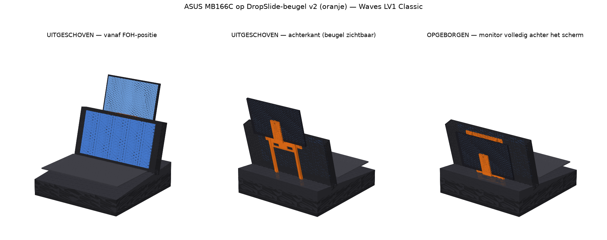
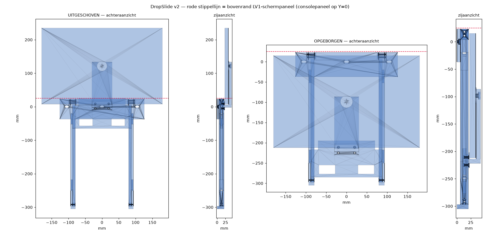

# DropSlide v2 — uitschuifbare monitorbeugel voor de LV1 Classic

3D-printbare slide-mount die een **ASUS ZenScreen MB166C (15,6")** achter het
scherm van de **Waves eMotion LV1 Classic** hangt, aan de drie bestaande
inbusbouten bovenaan het achterpaneel.

- **Uittrekken** → de monitor klikt vast in de bovenstand en steekt ~210 mm
  boven de rand van de LV1 uit. Vanaf de FOH-positie zie je alléén de
  monitor: alle dragende delen blijven onder de rand of achter de monitor.
- **Opruimen** → naar beneden duwen tot de tweede klik; de monitor verdwijnt
  volledig achter het schermpaneel (bovenkant 10 mm onder de rand).



## Constructie

Een montageplaat op de drie consolebouten draagt twee C-rails die langs het
geventileerde paneel naar beneden lopen. In de rails schuift een basisplaat
(de slede). Op de slede zit een **U-arm** geschroefd die ónder de monitor
doorloopt en hem aan de achterzijde vastpakt: een 1/4"-20 bout in het
statiefdraad-inzetstuk van de monitor plus een goot waar de onderrand in
valt. Daardoor hangt de monitor met het beeld naar de operator, zonder dat
er iets voor het scherm zit.



## Onderdelen (map `stl/`)

| Bestand | Aantal | Print­oriëntatie |
|---|---|---|
| `01_montageplaat.stl` | 1 | plat op de rug (moffen omhoog) |
| `02_rail_links.stl` / `03_rail_rechts.stl` | 1+1 | liggend op de **buitenwand**, diagonaal op het bed (319 mm) |
| `04_slede.stl` | 1 | plat op de rug |
| `05_voet_links.stl` / `06_voet_rechts.stl` | 1+1 | plug omhoog |
| `07_arm.stl` | 1 | liggend op de rug van de armplaat (voet omhoog) |
| `preview_*.stl` | — | niet printen, alleen ter controle |

**Printinstellingen:** PETG (stijver en taaier dan PLA in een warme
flightcase), 0,2 mm laag, 4 wanden, 40 % infill. Bladveren in de rails
printen mee — geen support nodig in de aangegeven oriëntaties. Rails passen
diagonaal op een 256 × 256 bed (Bambu X1C/P1S).

## Bill of materials

- 3× inbusbout in de originele console-draad, **8 mm langer** dan origineel
  (originele bout eruit, lengte + draad meten: vermoedelijk M4)
- 4× M3×25 + M3-moer — railpennen in de moffen van de plaat
- 4× M3×12 + M3-moer — armflens op de slede
- 2× M3×12 zelftappend/plaatschroef — voetjes onderin de rails
- 1× 1/4"-20 × 3/8" (9,5 mm) inbusbout + ring — statiefdraad monitor
- Dun schuimtape op gootbodem en contactboss (krasbescherming), en op de
  afstandshouders van de voetjes
- Beetje siliconen-/PTFE-vet in de railkanalen

## Montage

1. Schroef de U-arm met 4× M3×12 op de slede (moeren vallen in de zakken aan
   de achterzijde van de slede, koppen verzonken in de flens).
2. Zet de monitor met zijn onderrand in de goot en borg hem met de
   1/4"-bout (verzonken zeskantzak achterin de armplaat) in het
   statiefdraad. Schuimtape ertussen.
3. Steek de railpennen in de moffen van de montageplaat, borg met 2× M3×25
   per rail (moeren in de zeskantzakken aan de binnenzijde).
4. Schuif de slede (met arm + monitor) van onderaf in beide railkanalen.
5. Schroef de voetjes in de kanaalonderkant (M3 zelftappend, dwars).
6. Haal de drie originele inbusbouten uit het achterpaneel, hang de plaat op
   met de langere bouten. De sleufgaten geven ±6 mm speling per bout.
7. USB-C-kabel van de monitor met een lus langs een rail naar beneden
   tie-wrappen, zodat hij de slag van 220 mm meemaakt.

## Werking detents

Elke rail heeft twee geprinte bladveren met een asymmetrische tand:

- **Bovenste detent** (uitgeschoven): borgvlak van 28° draagt het gewicht
  van de monitor, oprijvlak van 50° zodat omhoog trekken soepel gaat. Een
  ferme duw naar beneden ontgrendelt.
- **Onderste detent** (opgeborgen): gespiegeld, zodat de slede tijdens
  transport in de flightcase niet omhoog kan stuiteren. De slede rust
  daarnaast op de voetjes.

Te stroef of te los? Pas in `lv1_slide_mount.py` de parameters `tooth`
(uitsteek), `leaf_t` (veerdikte) of de hoeken `hold_ang`/`ride_ang` aan en
genereer opnieuw.

## Vóór het printen even nameten

Het model is parametrisch; deze maten staan nu op een aanname (gemarkeerd
met `[METEN!]` in `lv1_slide_mount.py`):

1. **`bolt_dx`** — hart-op-hart afstand tussen de naastgelegen consolebouten
   (nu 105 mm; sleufgaten vangen ±6 mm op).
2. **`bolt_hole_dia`** — draadmaat van die bouten: M4 → 4,6, M5 → 5,6.
3. **`top_edge_offset`** — afstand van de boutenrij tot de bovenrand van het
   schermpaneel (nu 25 mm).
4. **`tripod_from_bottom`** — hoogte van het 1/4"-draadgat vanaf de
   onderrand van de monitor (nu 113,5 mm = precies het midden).
5. **Vrije vlakke hoogte** op het achterpaneel onder de boutenrij: er is
   **305 mm** nodig, specifiek op ±80 tot ±95 mm links en rechts van het
   midden (daar lopen de rails). Let op de strip met de 12V-lampaansluiting
   (XLR4) en USB-poorten onderaan het schermdeel — rails en voetjes moeten
   daar vrij van blijven. Ook checken: de flightcase moet ~50 mm ruimte
   achter het paneel hebben (het geheel bouwt ~43 mm naar achteren uit).

Komt maat 5 niet uit, dan kan de slag korter: minder zichtbare schermhoogte
uitgeschoven, maar ook een korter railpakket. Dat is één parameter.

Daarna:

```bash
pip install manifold3d trimesh numpy
python3 lv1_slide_mount.py
```

## Let op

- De rails staan 6 mm van het paneel en zijn 14 mm breed; de monitor hangt
  er ruim 20 mm vóór — de ventilatiesleuven blijven vrijwel volledig vrij.
  Blokkeer ze niet met kabels.
- Dit hangt aan het chassis van de console; er wordt níet in de console
  geboord en er draait geen software op de LV1 zelf. De NDI-feed gaat naar
  de monitor via een externe bron (bijv. Mac mini of NDI-decoder, USB-C).
